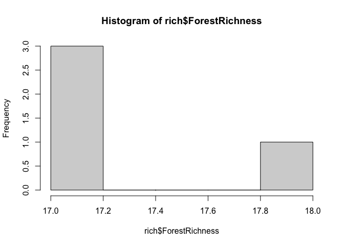
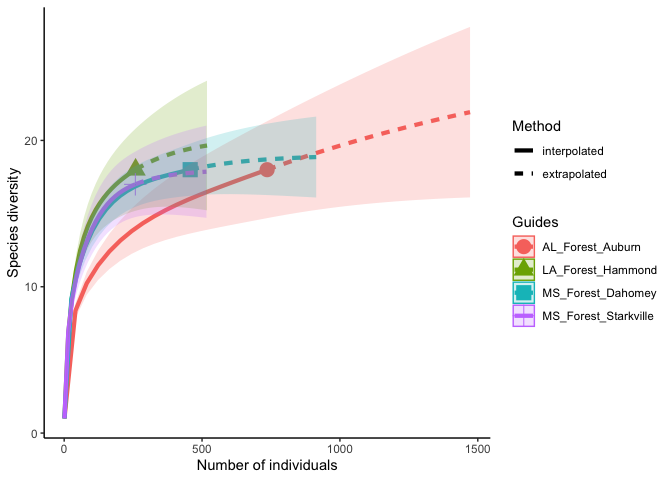
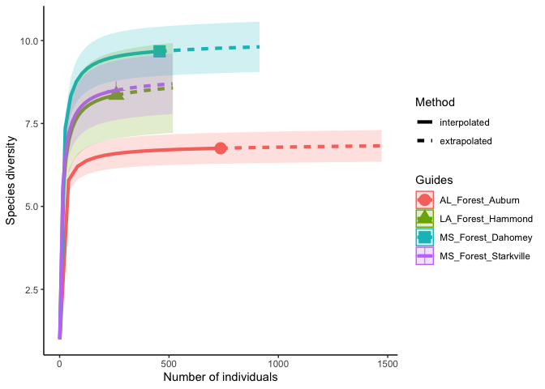
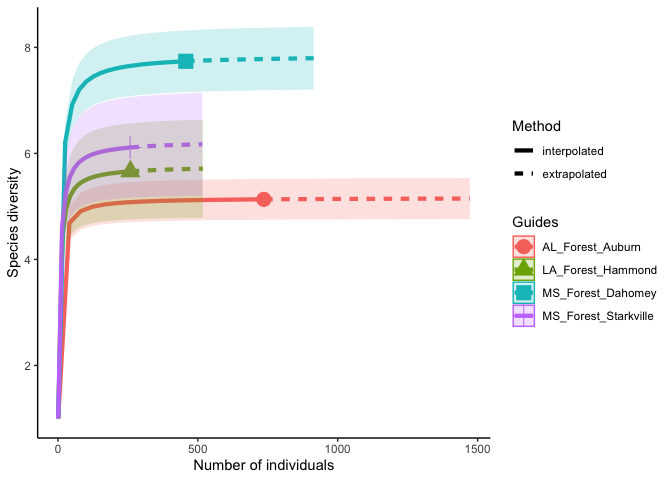
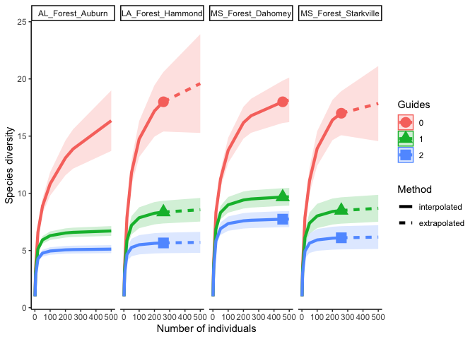
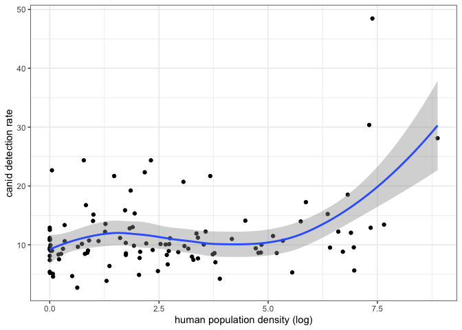
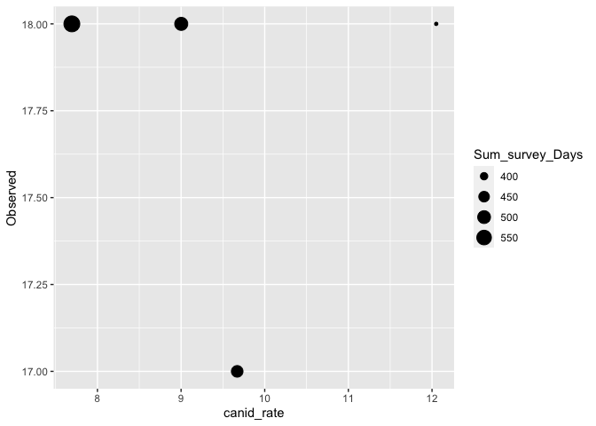

## Measuring communities through camera traps
Camera traps are a great way to monitor species & communities. They are minimally invasive & provide a way to see what animals are doing without interfering with them. They can be deployed for long periods of time (many models will run for ~10 months on 1 set of batteries), making them a time and cost effective method for monitoring medium to large sized mammals.    

We'll explore how to organize and interpret data from camera traps by first using some public data downloaded from the Snapshot 2019 data set (https://esajournals.onlinelibrary.wiley.com/doi/full/10.1002/ecy.3353). This was a coordinated camera trap survey across the US in 2019 that has now been repeated in 2020 & 2021. Both of those additional years of data are available.  


```r
#Download a Google Sheet of the data. FYI This will take a few minutes.
library(tidyverse)
library(stringr)
ssUSA <- read.csv("./data/snapshot/SNAPSHOT_USA_2019_observations.csv")
```

Let's have a quick look at what we have in these data

```r
dim(ssUSA) #Dimensions of cam. How many rows & columns.
```

```
## [1] 166036     14
```

```r
names(ssUSA)
```

```
##  [1] "Project"           "Camera_Trap_Array" "Site_Name"        
##  [4] "Deployment_ID"     "Sequence_ID"       "Begin_Time"       
##  [7] "End_Time"          "Species_Name"      "Common_Name"      
## [10] "Age"               "Sex"               "Count"            
## [13] "Latitude"          "Longitude"
```

I want to start summarizing some of the data into counts of each species type per Camera Trap Array (or location). Every array is a subproject or place where at least 10 cameras were set up, with each camera at least 200 m away from each other and no more than 5 km from another camera. I only need a few of the columns, so I'm going to select those first so that I can count up the number of species found in each array This will give a table with species as rows and arrays as columns. I have set it up this way because the package that we'll use to analyze diversity `iNEXT` requires this format.

We'll work with a few camera trap arrays from the Gulf region so that the diversity cureve data are a little easier to visualize. 


```r
speciesCount <- ssUSA %>% filter(str_detect(Camera_Trap_Array, c("LA", "MS", "AL"))) %>% 
  dplyr::select(Common_Name, Count, Camera_Trap_Array) %>% 
  group_by(Common_Name, Camera_Trap_Array) %>% #Here I group the data by species and the subproject
  summarize(totalCount = sum(Count)) %>% #This now gives the sum of the count of each species per subproject
  spread(Camera_Trap_Array, totalCount) #Now I need to change the orientation so that species are rows and subprojects are columns. This pivots the table to do that. More explanation here: https://rpubs.com/bradleyboehmke/data_wrangling
speciesCount
```

```
## # A tibble: 29 × 5
## # Groups:   Common_Name [29]
##    Common_Name           AL_Forest_Auburn LA_Forest_Hammond MS_Forest_Dahomey
##    <chr>                            <int>             <int>             <int>
##  1 Bobcat                              NA                NA                 4
##  2 Camera Trapper                       1                11                12
##  3 Coyote                               4                 5                 4
##  4 Domestic Cat                        NA                 7                NA
##  5 Domestic Dog                        NA                 1                 1
##  6 Eastern Chipmunk                    10                NA                NA
##  7 Eastern Cottontail                   5                NA                 6
##  8 Eastern Fox Squirrel                NA                NA                 5
##  9 Eastern Gray Squirrel              162                61                48
## 10 Gray Fox                             5                 2                NA
## # … with 19 more rows, and 1 more variable: MS_Forest_Starkville <int>
```

This now tells us how many times each species appeared on a photo sequence in each location.

## Richness, Abundance, & Diversity
There are a few ways to think about communities of species and their composition. **Richness** is just the number of species that are present at site. This is an easy one -- we can just count those up. **Abundance** is the number of individuals of each species in a site. This takes a bit to calculate.  **Diversity** is a combination of richness & abundance. It can be calculated in a few different ways, but defines the different number of species in an area (richness) and its abundance and the distribution of these species in that ecosystem. It’s a measure of the variety in the ecosystem.

Diversity in an ecological community can tell you a lot about what kind of community it is. Does it have a lot of different kinds of opportunities & ecological niches? Are there many types of feeding and resting habitats available?     

In this exercise we'll calculate different diversity metrics to understand how mammal communities can change. We'll use the package `iNEXT` to do this. This program calculates Hill numbers that allow us to compare communities of different sizes. Hill numbers are the *effective number of species* and can be a direct reflection of older diversity metrics, but are a better measure of diversity because the non-linearity of other diversity indices (like the Shannon Diversity Index), makes it difficult to really interpret the values across many studies. Hill numbers are more straight-forward. A nice set of examples and discussion here: https://jonlefcheck.net/2012/10/23/diversity-as-effective-numbers/.  

#### Richness
First, we'll calculate a very simple **Richness** calculation for each array. Richness is just the number of species present, and we could sum it up easily:


```r
rich <- ssUSA %>% filter(str_detect(Camera_Trap_Array, c("LA", "MS", "AL"))) %>%
  group_by(Camera_Trap_Array) %>% 
  filter(!is.na(Species_Name)) %>%  #filter out any NAs in the species name, just in case
  summarize(ForestRichness = length(unique(Species_Name)))

hist(rich$ForestRichness, breaks = "FD")
```

<!-- -->
We can see that each of the arrays has 17-18 (ish) species, but we have no idea about the diversity, evenness, or overlap among those species. For all we know those data sets could be made of 97% white-tailed deer and 1 photo sequence each of another 18 - 32 mammal species. We can turn to `iNext` to figure some of this out. You can see more about `iNEXT` here, including different plotting types & analysis: https://cran.r-project.org/web/packages/iNEXT/vignettes/Introduction.html. FYI, there are supposed to be 400ish terrestrial mammal species in all of the continental USA including bats & rodents (the two most speciose Orders) that camera traps most likely wouldn't capture.     

To make our data play nicely with `iNEXT`, it needs to be transformed slightly. This is done below.


```r
speciesCount[is.na(speciesCount)]=0 #This turns the NAs that come from summing 0's into real 0's for analysis
specCount_df <- as.data.frame(speciesCount) #Since iNext wants a data frame, turn the tibble into one
rownames(specCount_df) <- specCount_df$Common_Name #iNext also wants the species ID as row names. 
specCount_df <- specCount_df %>% select(-Common_Name) #Now we can get rid of the species name since it's already in our row name.
```

Now that the data are in a format `iNEXT` likes, we can calculate statistical species **Richness** for comparison across sites. Because our data are counts, the data type is abundance. Hill numbers are calculated as: $$^{q}D = (\sum_{i=1}^{S}p_{i})^{1/(1-q)}$$

Where: *S* is the number of species in the assemblage and each *i* species has the relative abundance $p_{i}$. By changing the exponent *q* we change how sensitive the equation is to relative frequencies and therefore the shape of the distribution and what it represents. *q* = 0 is Richness, *q* = 1 is the Shannon Diversity index, and *q* = 2 is the Simpson's Diversity index. More on those below.

#### Richness
So, we can calculate species **Richness** and then plot richness for each forest. 

```r
richness <- iNEXT(specCount_df, q=0, datatype = "abundance") #This calculates hill numbers for the number of observations we have. q changes the expected relationship. 0 will give Richness
ggiNEXT(richness)+
  theme(legend.position = "right")+
  theme_classic()
```

<!-- -->
These figures show rarefaction curves that tell you how many species are identified (Y) per number of individuals in the data set (X). `iNext` tells you if this is interpolated (based on the range of the observed data) or extrapolated to a maximum number of individuals. We can do this for all of the sites, but it wouldn't plot nearly as nice -- we'd just see the legend. 


#### Diversity
The first diversity index that Hill numbers calculate is equivalent to the Shannon Diversity Index. This index accounts both for richness and evenness, so is generally a more preffered measure of diversity

```r
diversity_Shan <- iNEXT(specCount_df, q=1, datatype = "abundance") #This calculates hill numbers for the number of observations we have. q changes the expected relationship. q=1 gives the Shannon Diversity index. 
ggiNEXT(diversity_Shan)+
  theme(legend.position = "right")+
  theme_classic()
```

<!-- -->
This basic richness value can also be directly called by the `DataInfo( )` function on the data frame. 


```r
DataInfo(specCount_df)
```

```
##                   site   n S.obs     SC f1 f2 f3 f4 f5 f6 f7 f8 f9 f10
## 1     AL_Forest_Auburn 736    18 0.9932  5  0  1  1  2  1  0  0  0   1
## 2    LA_Forest_Hammond 259    18 0.9885  3  2  1  2  1  0  1  1  0   2
## 3    MS_Forest_Dahomey 457    18 0.9956  2  0  2  2  2  1  0  1  0   0
## 4 MS_Forest_Starkville 258    17 0.9923  2  2  4  1  0  0  2  0  0   0
```
This returns basic data information including the site name (site), reference sample size (n), observed species richness (S.obs), a sample coverage estimate (SC), and the first ten frequency counts (f1-f10), whereby f1 denotes the number of species represented by exactly one individual (i.e., “singletons”), f2 denotes the number of species represented by exactly two individuals (i.e., “doubletons”), and fk denotes the number of species represented by exactly k individuals.


The next diversity index is Simpson's Diversity Index.  This discounts all but the most common species and generally thought of as a dominance type of index.

```r
diversity_Simps <- iNEXT(specCount_df, q=2, datatype = "abundance") #This calculates hill numbers for the number of observations we have. q changes the expected relationship. q=2 gives the Simpsons Diversity index.  
ggiNEXT(diversity_Simps)+
  theme(legend.position = "right")+
  theme_classic()
```

<!-- -->

These can also all be run at the same time and we can look at the effects of each diversity calculation (*q*) within each site. We can also specify the number of knots (k) or the number of points on the X axis at which to calculate diversity

```r
k <- c(1, 5, 20, 50, 100, 200, 250, 500)
allDiversity <- iNEXT(specCount_df, q=c(0, 1, 2), datatype="abundance", size = k, endpoint=1000)
ggiNEXT(allDiversity, type=1, facet.var="site")+
  theme_classic()
```

<!-- -->
We can see that those curves aren't as smooth as the ones above since they are built on 8 estimates only.

### Getting 1 value?
We might be tempted to want a single value to represent the diversity of our sites. But one of the things that we see from the rarefaction curves is that sampling effort (number of individuals) influences the diversity numbers. From the figures above, sampling effort of about 250 gives us an asymptotic diversity measure for each of our sites. We can use that value to find our single diversity estimates or use the asymptotic diveristy from `iNext` regardless of the number, as long as we have inspected the curves to make sure that that asymptote isn't too variable among sites. 


```r
siteDiversity <- allDiversity$AsyEst
```


## Plotting our data in space
These are data that were collected in a spatial context, so why not make a map? We have the latitude & longitude of each camera, so the site diversity could be plotted.

We can make a true map of these measures. We'll add in the lat/long of the average camera locations to describe the site, then pull state boundaries & plot our camera locations.


```r
siteLocs <- ssUSA %>% filter(str_detect(Camera_Trap_Array, c("LA", "MS", "AL"))) %>%
  group_by(Camera_Trap_Array) %>%
  summarize(location.long = mean(Longitude),
            location.lat = mean(Latitude))
siteDiversity <- siteDiversity %>% 
  left_join(siteLocs, by = c("Site" = "Camera_Trap_Array"))


library(sf)

<<<<<<< HEAD
usa <- st_as_sf(maps::map("state", fill=TRUE, plot =FALSE))
=======
usa <- st_as_sf(maps::map("usa", fill=TRUE, plot =FALSE))
>>>>>>> 8d7f78fad8b318a174334ee51eafcabc8c287e44

gulf <- st_as_sf(maps::map("state", region= c("Alabama", "Mississippi", "Louisiana"), fill=TRUE, plot =FALSE))

siteDiversity %>% 
  filter(Diversity == "Shannon diversity") %>% 
  ggplot()+
  geom_sf(data = gulf)+
  geom_point(aes(x = location.long, y = location.lat, color = Observed, size = Observed))+
  scale_color_viridis_c()
```

```
## Error: <text>:11:1: unexpected input
## 10: 
## 11: <<
##     ^
```

## Putting additonal ecological context into camera traps

We could annotate the locations of the arrays with a bunch of environmental information that we derive from remote sensing data directly or through Movebank. Lucky for us, a lot of this general information has already been annotated into this data set for us. We'll pull in an excel file that has 2 sheets. "Sites" shows the number of sites within an array where a species was detected and "detections" shows the total number of "detections". Let's work with "detections". 


```r
library(readxl)

detections <- read_xlsx("./data/snapshot/SS_usa2019__per_subproject.xlsx", sheet = "detections")
```

Maybe we are interested in the canid species and how often they are found in proximity to humans. We can compare total counts of canids, standardized by the number of survey days to variables like human population density or the distance to the nearest building.


```r
detections <- detections %>% 
  mutate(canid_rate = sum(`Detections Gray Wolf)`,
                             `Detections Red Wolf)`, 
                             `Detections Coyote)`,
                             `Detections Red Fox)`,
                             `Detections Gray Fox)`,
                             `Detections Kit Fox)`) / `Sum_survey_Days`)
ggplot(detections)+
  geom_point(aes(x = log_human_pop, y = canid_rate))+
  geom_smooth(aes(x = log_human_pop, y = canid_rate))+
  theme_bw()+
  labs(x = "human population density (log)",
       y = "canid detection rate")
```

<!-- -->

Data like this could be used to test hypothesis related to urbanization and human shields and how different levels of productivity influence diversity metrics. We can combine the array-level detections with our calculated diversity metrics as well. Our calculated diversity metrics were only for a handful of sites, so there will be a lot of NA's. Maybe we want to see if canid detection rates influence overall species richness


```r
alldat <- detections %>% left_join(siteDiversity, by = c(`Row Labels` = "Site"))

alldat %>% filter(Diversity == "Species richness") %>% 
  ggplot()+
  geom_point(aes(x = canid_rate, y = Observed, size = Sum_survey_Days))
```

<!-- -->

# Assignment

1. There are multiple hypothesis that link higher species diversity to lower latitudes -- there are more species closer to the tropics. Is this true in the US? Please make 2 plots: one for species richness and one for diversity (y-axis) versus latitude (x-axis) for all of the Snapshot USA sites.


2. Everything likes to eat rabbits. I want to test the hypothesis that total species diversity (measured through the Shannon Index) is positively related to bunny detection rates. Create a plot of total rabbit & hare detection rates (x-axis) vs Shannon Diversity Index (y-axis). To create your bunny rate, you should sum up the Black-tailed Jackrabbit, Desert Cottontail, Eastern Cottontail, Marsh Rabbit Pygmy Rabbit, Swamp rabbit , Snowshoe Hare, Unknown Cottontail, Unknown Rabbit_Hare, and White-tailed Jackrabbit.


3. Create a map of the lower 48 Snapshot USA sites. Color them by Shannon Diversity Index and scale their size by the sum of their overall detection rate for all species combined.


