class: right, bottom
background-image: url("figs/WTAGAntarctica.jpg")
background-size: cover

.titlestyle1[        Spatial Data in R]  

<link rel="stylesheet" type="text/css" href="//fonts.googleapis.com/css?family=Lora" />

.captionstyle[The Albatrosses Circling Antarctica by James Cheshire & Oliver Uberti]

```{r setup, include=FALSE}
options(htmltools.dir.version = FALSE)
knitr::opts_chunk$set(fig.align = "center", message = FALSE
                       #, cache = TRUE # for fast builds. Comment out for stability
                      )
```

```{r xaringan-themer, include=FALSE, warning=FALSE, eval=FALSE}
# remotes::install_github("gadenbuie/xaringanthemer")
library(xaringanthemer)
style_mono_accent(
  base_color = "#213c47",
  header_font_google = google_font("Josefin Sans"),
  text_font_google   = google_font("PT Sans Narrow"),
  code_font_google   = google_font("Source Code Pro"),
  header_background_auto = TRUE,
  header_h1_font_size = "2rem",
  header_h2_font_size = "1.8rem",
  header_h3_font_size = "1.6rem",
  header_background_padding = "15px",
  header_background_content_padding_top = "4.5rem",
  outfile = "lecture/xaringan-themer.css"
)
```
---
# Introduction
Today we are going to get our first taste of working with movement data in R, but we will begin by introducing you to spatial data analysis in R more generally.

We will review some of the R packages available for handling spatial data, discuss the
format of different spatial data types, and explore how we can manipulate and visualize these
in R. 

Much of the info on spatial data was taken directly from Robin Lovelace & Jakub Nowosad's SIGR workshops (https://github.com/Nowosad/SIGR2021), and as well as the Animove animal movement course (http://animove.org/), Dana Seidel & Eric Dougherty's Movement Ecology workshop (https://www.danaseidel.com/MovEco-R-Workshop/),and Jamie Afflerbach's introduction 
to the `sf` library and spatial analysis in R (see her [spatial-analysis-R repo](https://github.com/jafflerbach/spatial-analysis-R)).

---
# Resources
There are some additional excellent resources available to start thinking about spatial data in R
- Geocomputation with R by Robin Lovelace, Jakob Nowosad, and Jannes Muenchow: https://geocompr.robinlovelace.net/

- Modern Geospatial Data Analysis with R, lecture deck by Zev Ross: http://files.zevross.com/workshops/spatial/slides/html/0-deck-list.html

- Analysing and Maping Animal Movement in R by Kamran Safi, Bart Kranstauber, & Anne Scharf (on Moodle)

---
class: inverse, left, bottom
# GIS ecosystem of R


---
# R spatial
.left-column[
- Ecology
- Earth-Observation
- Economics
- Demography
- Politics
- Journalism
- Archeology
- Transport
- Climatology
- Meteorology
- Geomorphometry
- Hydrology
- Urban-Planning
- Mining
- Marine-Studies
- Soil-Science
- Tourism
- and many more...
]
.rc[
<a href="https://www.tylermw.com/3d-maps-with-rayshader/">
```{r, out.width="85%", echo=FALSE}
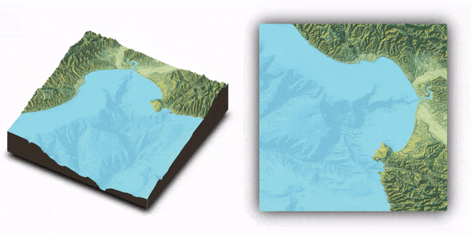
```
</a>
<a href="https://www.mdpi.com/2306-5729/4/3/92">
```{r, echo=FALSE, out.width="85%"}
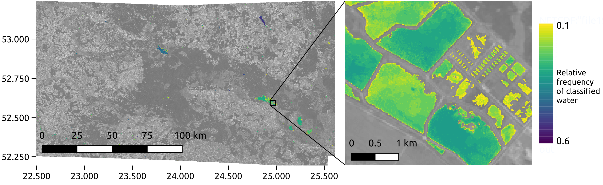
```
</a>
]

---
# R spatial

.pull-left[

- Spatial aspect can be important in any part of data analysis - data preparation, vizualization, modeling, or communicating the results
- It does not need to be the most important part
- R is great to integrate various aspects of analysis

<a href=" https://ikashnitsky.github.io/2018/the-lancet-paper/">
```{r, out.width="90%", echo=FALSE}
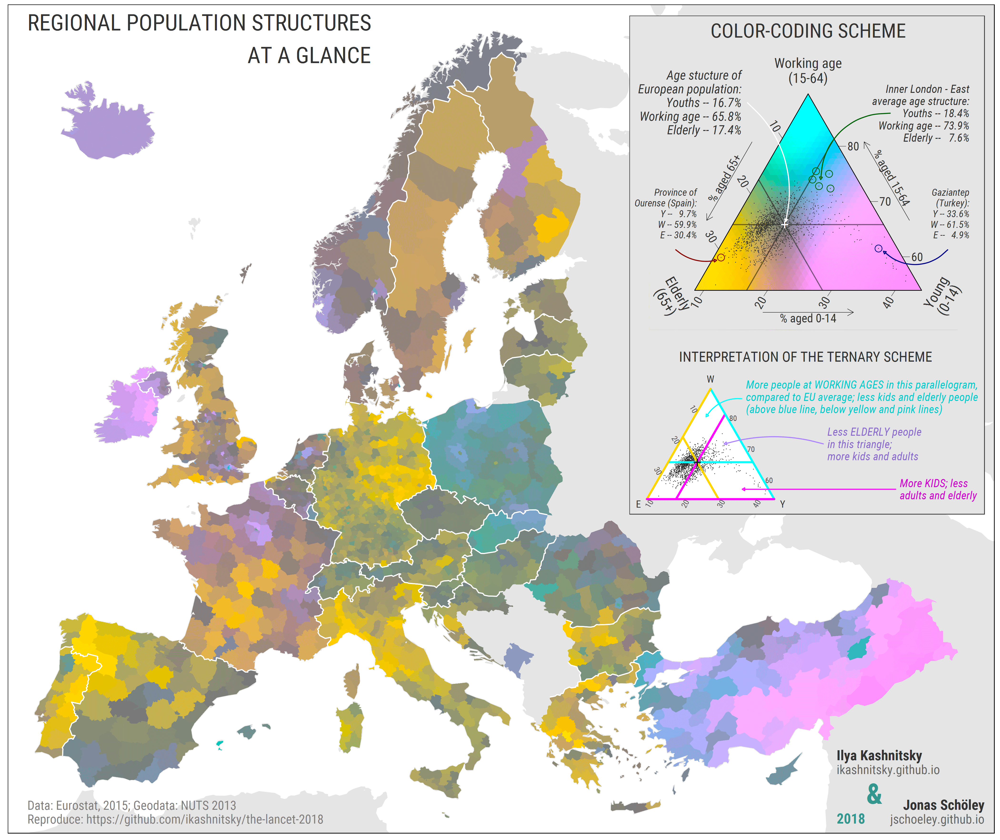
```
</a>

]

.pull-right[
<a href="https://riatelab.github.io/MDM/">
```{r, echo=FALSE}
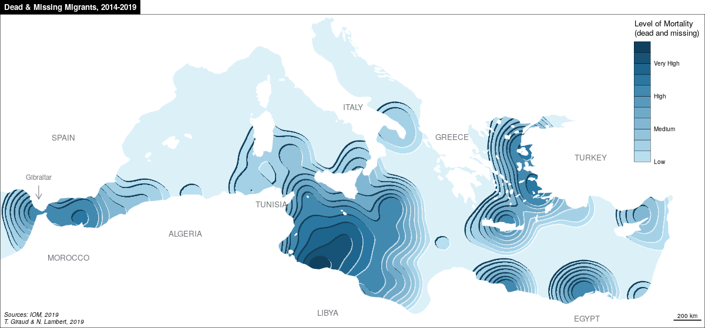
```
</a>
<br>
<a href="https://www.pct.bike/">
```{r, echo=FALSE}
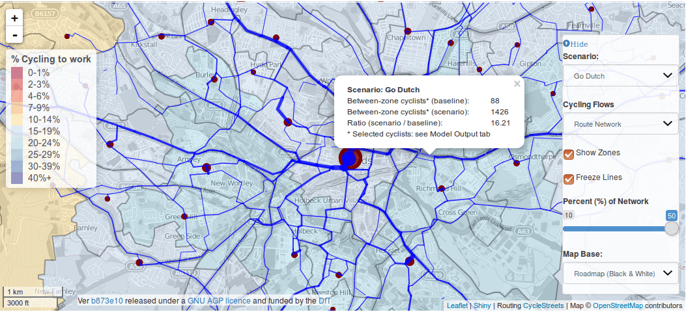
```
</a>
]

---
# R spatial

.pull-left[
<a href="https://github.com/mtennekes/tmap/tree/master/demo/ClassicMap">
```{r, echo=FALSE}
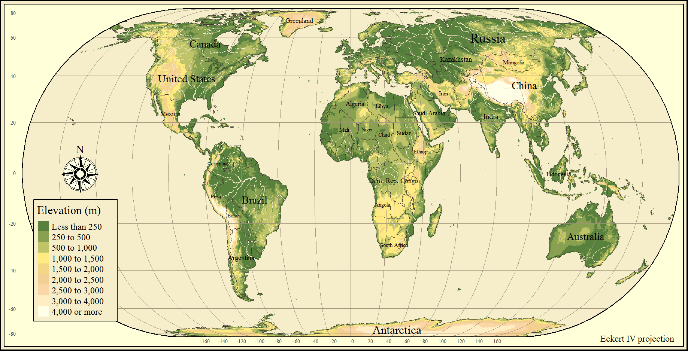
```
</a>
<a href="https://github.com/Z3tt/30DayMapChallenge">
```{r, echo=FALSE}
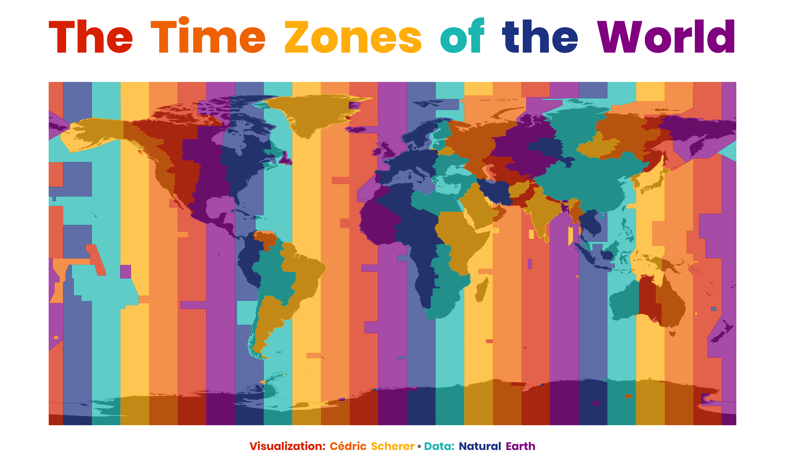
```
</a>
]

.pull-right[
- https://geocompr.github.io/
- https://www.rspatial.org/
- https://www.r-spatial.org/
- `#rspatial` and `#geocompr` on Twitter

<a href="https://nowosad.github.io/post/maps-distortion/">
```{r, echo=FALSE}
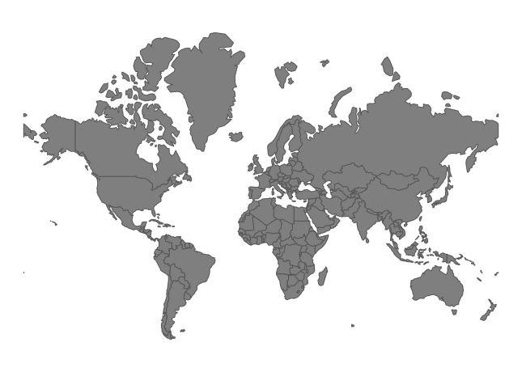
```
</a>
]

---

# What can you do with geographic data + R?

.lc[

- Exploratory data analysis ([EDA](https://r4ds.had.co.nz/exploratory-data-analysis.html))
- Output data in different formats (e.g. creating a .GeoTIFF or .shp file to share with others)
- Data processing (e.g. adding new variables, 'adding value')
- Data transformation (e.g. [changing CRS](https://geocompr.robinlovelace.net/reproj-geo-data.html), reducing size via simplification/aggregation)
- Data [visualisation](https://geocompr.robinlovelace.net/adv-map.html#mapping-applications)
- Web application development
- Software development e.g. to share new methdods

]

.rc[

```{r, out.width="100%", echo=FALSE}
knitr::include_graphics("https://user-images.githubusercontent.com/1825120/38543030-5794b6f0-3c9b-11e8-9da9-10ec1f3ea726.gif")
```

]

---

# R is a (geo)computational power tool! 

.left-column[

#### R's flexibility enables 100s of people to create new tools

#### R can be seen as the 'engine' that enables functionality provided in packages


#### That provides flexibility but has some consequences...

]

--

.right-column[

### It's important to use the right tool for the job


]

---

# Sharing your ideas with R

## R's ecosystem makes it easy to communicate your results

```{r, echo=FALSE}
knitr::include_graphics("https://user-images.githubusercontent.com/1825120/123699833-9a744e80-d857-11eb-9fde-3847970a04dc.png")
```

---

# Tips for sharing maps

.pull-left[

- Copy paste into emails
- Set width and resolution carefully for publication
- Use vector graphics (e.g. svg/pdf) when appropriate
- Save `tmap` maps with `tmap_save(map, "map.html")` and send the html
- One click publishing with RStudio

## See rpubs.com/robinlovelace

]

.pull-right[


]

---
# R packages for spatial data

- [**sf**](https://github.com/r-spatial/sf),
[**sp**](https://github.com/edzer/sp),
[**terra**](https://github.com/rspatial/terra),
[**raster**](https://github.com/rspatial/raster), [**stars**](https://github.com/r-spatial/stars) - spatial classes
- [**dplyr**](https://github.com/tidyverse/dplyr), [**rmapshaper**](https://github.com/ateucher/rmapshaper) - processing of attribute tables/geometries 
- [**rnaturalearth**](https://github.com/ropensci/rnaturalearth), [**osmdata**](https://github.com/ropensci/osmdata), [**getlandsat**](https://github.com/ropensci/getlandsat) - spatial data download
- [**rgrass7**](https://github.com/rsbivand/rgrass7), [**qgisprocess**](https://github.com/paleolimbot/qgisprocess), [**RSAGA**](https://github.com/r-spatial/RSAGA), [**link2GI**](https://github.com/r-spatial/link2GI) - connecting with GIS software
- [**gstat**](https://github.com/r-spatial/gstat), [**mlr3**](https://github.com/mlr-org/mlr3), [**CAST**](https://github.com/HannaMeyer/CAST) - spatial data modeling
- [**rasterVis**](https://github.com/oscarperpinan/rastervis), [**tmap**](https://github.com/mtennekes/tmap), [**ggplot2**](https://github.com/tidyverse/ggplot2) - static visualizations
- [**leaflet**](https://github.com/rstudio/leaflet), [**mapview**](https://github.com/r-spatial/mapview), [**mapdeck**](https://github.com/SymbolixAU/mapdeck) - interactive visualizations
- many more...

Learn more at https://cran.r-project.org/web/views/Spatial.html.

---
# R packages - specialized packages

- [**move**]
- [**adeHabitatHR**]
- [**adeHabitatLT**]
- [**momentuHMM**]
- [**spatstat**](http://spatstat.org/)
- [**spdep**](https://github.com/r-spatial/spdep)
- [**spatialreg**](https://github.com/r-spatial/spatialreg)
- [**dismo**](https://github.com/rspatial/dismo)
- [**landscapemetrics**](https://github.com/r-spatialecology/landscapemetrics) - part of https://github.com/r-spatialecology
- [**RStoolbox**](http://bleutner.github.io/RStoolbox/rstbx-docu/RStoolbox.html)
- [**rayshader**](https://github.com/tylermorganwall/rayshader)
- [**gdalcubes**](https://github.com/appelmar/gdalcubes_R)
- many more...

Learn more at https://cran.r-project.org/web/views/Spatial.html, https://cran.r-project.org/web/views/Environmetrics.html, and https://cran.r-project.org/web/views/SpatioTemporal.html.

---

# R packages 

- [How to cite R packages?](https://neuropsychology.github.io/psycho.R//2018/08/31/cite_packages.html)

```{r}
# citation()
citation("move")
```

---
class: inverse, left, bottom

# Classes of spatial data
---

# Classes of spatial data

.pull-left[
Spatial data come in two forms:

1. Vector data
2. Raster data

With important differences across classes.
]

.pull-right[
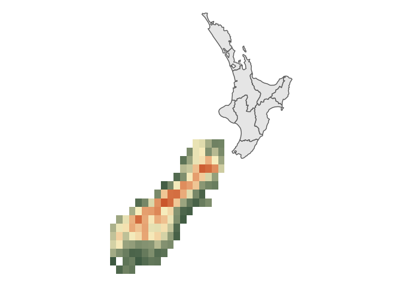
]

---

# Which type of data is best?

.pull-left[
Vector data are great for representing sites/locations, trajectories, boundaries, etc

Raster data tends to be more appropriate for physical sciences & can show more dense data types. Rasters show pixels of a given size with values in the pixel representing information like elevation, primary productivity, temperature, precipitation, etc. 

In Movement Ecology both are important. 
]

.pull-right[

]

---

# Vector Data

Vector models are a representation of the world using points, lines, and
polygons. This class is useful for storing data that has discrete boundaries,
such as country borders, land parcels, and streets. Animal movement data are nearly always (initially) represented as vectors since we generally start out with locations associated with a timestamp.

Often, vector data is stored as "Shapefiles" (.shp) or "GeoPackages ("gpkg"). Shapefiles are actually 3 files linked by their name. Simple features gets rid of this by creating a package file. 

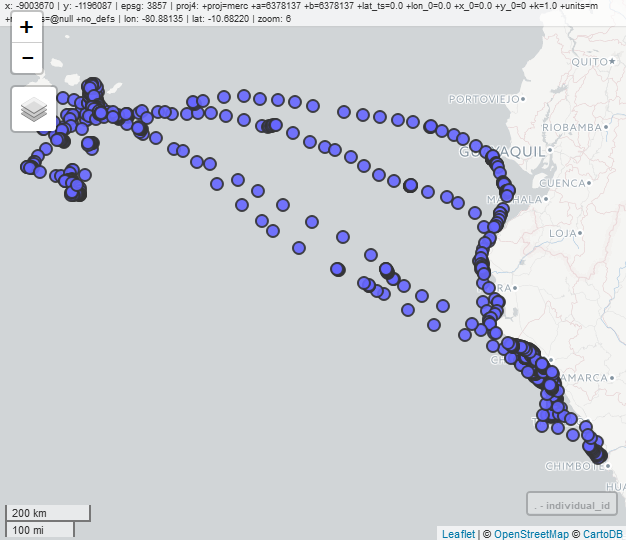

---

# Vector data model ecosystem of R

.pull-left[
- The **sf** package is the successor of the **sp** package based on the OGC standard Simple Features
- Combines the functionality of three previous packages: **sp**, **rgeos** and **rgdal**
- Most of the functions in this package start with a prefix `st_`
- This package handles additional vector data types (e.g. polygon and multipolygon are two separate classes), allows for easier data processing, and support for spatial databases such as PostGIS
- https://r-spatial.github.io/sf/ and https://github.com/rstudio/cheatsheets/blob/master/sf.pdf
]

.pull-right[
- The **terra** package has its own vector data classes.
]

---
# sf reading

```{r 05-rspatial-classes-8 }
file_path <- system.file("shapes/world.gpkg", package = "spData")
file_path
# world = read_sf(file_path)
```

```{r 05-rspatial-classes-8b, eval=FALSE}
# Bad: not reproducible
library(sf)
world <- read_sf("/home/jn/R/x86_64-redhat-linux-gnu-library/4.0/spData/shapes/world.gpkg")
world
```


---
# sf reading

```{r 05-rspatial-classes-9 }
library(sf)
file_path_txt <- system.file("misc/cycle_hire_xy.csv", package = "spData")
cycle_hire_xy <- read.csv(file_path_txt)
cycle_hire_sf <- st_as_sf(cycle_hire_xy, coords = c("X", "Y"))
cycle_hire_sf
```


---
# sf

- Combines the functionality of three previous packages: **sp**, **rgeos** and **rgdal**
- https://github.com/r-spatial/sf/wiki/Migrating
- Conversion from `sf` to `sp`:

```{r 05-rspatial-classes-2, echo=TRUE, message=FALSE}
library(spData)
library(sp)
library(sf)
world_sp <- as(world, Class = "Spatial")
# sp functions ...
```

- Conversion from `sp` to `sf`:

```{r 05-rspatial-classes-3, echo=TRUE}
world_sf <- st_as_sf(world_sp)
```


---
# sf

- Most of the functions in this package start with a prefix `st_`

```{r 05-rspatial-classes-4, echo=TRUE}
# lsf.str("package:sf")
ls("package:sf")
```

- TAB

---
# sf

```{r 05-rspatial-classes-6 }
library(spData)
library(sf)

world
```

---
# sf

```{r 05-rspatial-classes-7 }
plot(world)
```

---

# Raster Data

.pull-left[
Raster models are a representation of the world as a surface dividedinto a regular grid of cells. Satellite images are rasters, elevation models are rasters, and the photos your phone takes are rasters.    

These are useful for storing data that varies continuously, as in an aerial photograph, a satellite image, a surface of primary vegetations productivity, or an elevation surface.    
]

.pull-right[

]


---
# Raster Data

.pull-left
[Rasters are better used for continuous data like temperature, elevation, or landcover type

Often, Rasters are stored as "GeoTIFFs" (.tif). These are very heavy image files that are spatially registered and have a lot of additional metadata that describes the data. 
]

.pull-right
[
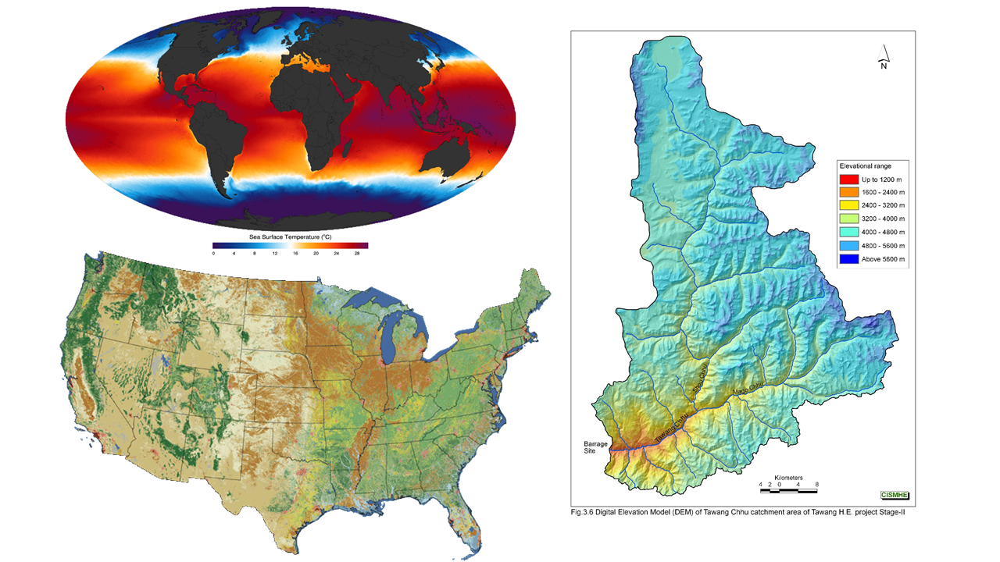

]


---

# Raster data model ecosystem of R

.pull-left[
**raster** and its successor **terra**

```{r, echo=FALSE, out.width="40%"}
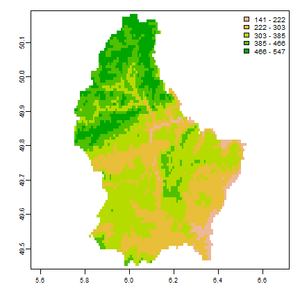
```


- The **terra** package contains classes and methods representing raster objects
- It allows raster data to be loaded and saved
- It allows raster algebra and raster processing
- It includes a number of additional functions, e.g., for analysis of terrain characteristics
- It allows you to work on large sets of data
- ?`terra-package`, https://rspatial.github.io/terra/reference/terra-package.html
- It is a successor of the **raster** package - http://www.rpubs.com/etiennebr/visualraster
]

--

.pull-right[
**stars**

```{r, echo=FALSE, out.width="80%"}
knitr::include_graphics("figs/cube2.png")
```


- The **stars** package contains classes and methods representing spatiotemporal data (raster and vector data cubes)
- It allows raster data to be loaded and saved
- It allows raster processing
- It allows you to work on large sets of data
- It supports regular, rotated, sheared, rectilinear and curvilinear rasters
- https://r-spatial.github.io/stars/
]

---
# terra

The **terra** package contains classes and methods representing raster objects

```{r 05-rspatial-classes-11 }
library(spData)
library(terra)

rast(elev)
```

---

# terra

```{r 05-rspatial-classes-13 }
raster_filepath <- system.file("raster/srtm.tif", package = "spDataLarge")
new_raster <- rast(raster_filepath)
new_raster
```

---
# terra

```{r 05-rspatial-classes-14, fig.height=5}
raster_filepath2 <- system.file("raster/landsat.tif", package = "spDataLarge")
new_raster2 <- rast(raster_filepath2)
plot(new_raster2)
```

---
class: inverse, left, bottom

# Spatial data are special: Coordinate reference systems

---

# Different Earths: Coordinate reference systems

.pull-left[
**Problem**: 

The earth is an obvoid sphere, paper & screens are flat. How do we flatten it out? 
]
.pull-right[

]

---

# Coordinate reference systems

.pull-left[
Geographic coordinate reference systems give coordinates which are:
- spherical (i.e. measured from the earth's center) or 
- planimetric (in which the earth's coordinates are projected onto a two-dimensional planar surface).  

Most spatial operations in the *sf* library assume coordinates are projected into a planar surface which typically lend themselves to more interpretable measurements e.g meters or kilometers.   

It is crucial when doing spatial analyses to know and match the coordinate systems 
across all of your datasets and ensure everything is properly projected, or your 
results may be incorrect or your analysis may fail. This is true whether you are
working with raster or vector data.
]

.pull-right[
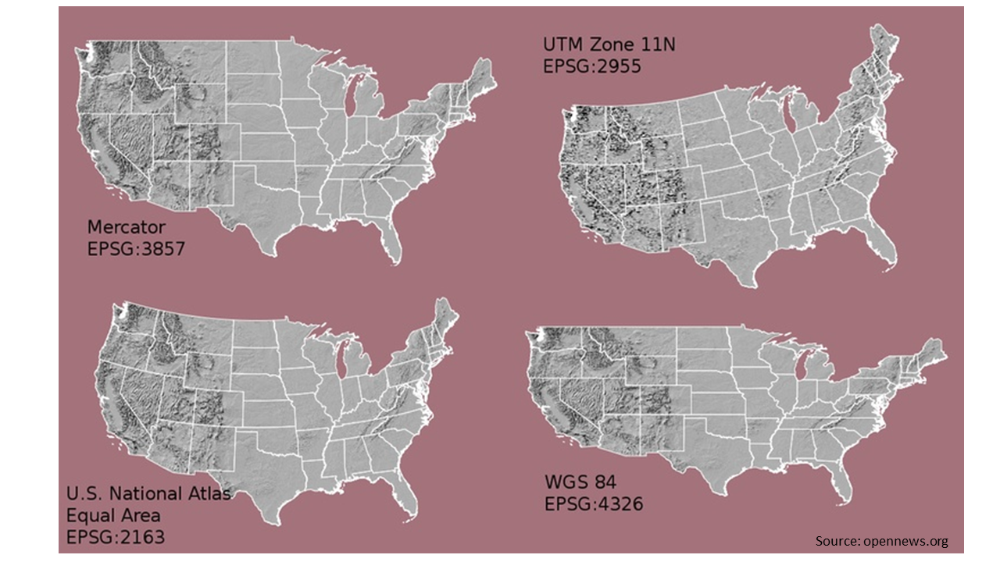

]

---

# Coordinates - numbers describing positions in space

.pull-left[
**Geographic coordinates**: angles (degrees; longitude and latitude) pointing out locations on a spherical or ellipsoidal surface (*ellipsoid - a mathematical approximation of the size and shape of the earth*)

```{r, warning=FALSE, purl=FALSE,echo=FALSE}
library(tmap)
library(sf)
point_sfc <- st_sfc(st_point(c(1, 1)), crs = 4326)
linestring_sfc <- st_sfc(st_linestring(rbind(c(0.8, 1), c(0.8, 1.2), c(1, 1.2))), crs = 4326)
polygon_sfc <- st_sfc(st_polygon(list(rbind(
  c(1.2, 0.6), c(1.4, 0.6), c(1.4, 0.8), c(1.2, 0.8), c(1.2, 0.6)
))), crs = 4326)
point_sf <- st_sf(geometry = point_sfc)
linestring_sf = st_sf(geometry = linestring_sfc)
polygon_sf <- st_sf(geometry = polygon_sfc)
polygon_sf$id <- as.factor(c(1))
polygon_sf_af <- polygon_sf
polygon_sf_af$geometry <- polygon_sf_af$geometry + c(20, 40)
polygon_sf_afp<- st_cast(polygon_sf_af, "MULTIPOINT")
tm_shape(polygon_sf_af) +
  tm_graticules() + 
  tm_polygons(col = "id", lwd = 7) +
  tm_shape(polygon_sf_afp) +
  tm_dots(size = 1) +
  tm_layout(main.title = "Geographic coordinates", legend.show = FALSE, inner.margins = 0.15) +
  tm_xlab("Longitude", space = 0.5) + 
  tm_ylab("Latitude", space = 0.5)
```
]

.pull-right[
**Projected coordinates**: measured on a two-dimensional flat space (e.g. in meters; x and y), related to an ellipsoid by projection

```{r, purl=FALSE,echo=FALSE, warning=FALSE}
library(tmap)
polygon_sf_p <- st_cast(polygon_sf, "MULTIPOINT")
tm_shape(polygon_sf) +
  tm_grid() + 
  tm_polygons(col = "id", lwd = 7) +
  tm_shape(polygon_sf_p) +
  tm_dots(size = 1) +
  tm_layout(main.title = "Projected coordinates", legend.show = FALSE, inner.margins = 0.15) +
  tm_xlab("X", space = 0.5) + 
  tm_ylab("Y", space = 0.5)
```
]


---
# Coordinate reference system (CRS)

**Coordinate reference system: a set of information describing the system used to locate objects in space.**

**It includes:**

- a set of mathematical rules for specifying how coordinates are to be assigned to points
- a set of parameters that define the position of the origin, the scale, and the orientation of a coordinate system (a datum)

----

**Two main groups of CRS:**

- Geographic coordinate reference systems, GCRS - composed of an ellipsoid and a datum; units in degrees
- Projected coordinate reference systems, PCRS - based on a GCRS and a projection


---
# How to describe CRS?

.pull-left[
**Two main current methods (see on the right):**

- CRS codes, e.g., EPSG:4326
- `WKT2`

**One (currently discouraged in most cases) method:**

- `proj4string` - `r st_crs(4326)$proj4string`

----

*More information:*

- https://proj.org/usage/projections.html
- https://spatialreference.org/ref/epsg/
- https://www.youtube.com/watch?v=Va0STgco7-4 (especially 10:47-27:48)
- https://www.gaia-gis.it/fossil/libspatialite/wiki?name=PROJ.6
- https://ihatecoordinatesystems.com/
]

.pull-right[
.tiny[
```{r, purl=FALSE,echo=FALSE}
st_crs(4326)
```
]
]


```{r, results="asis", purl=FALSE,echo=FALSE, eval=FALSE}
crs_data = rgdal::make_EPSG()

st_crs(crs_data$code[[4326]])
crs_data %>% 
  dplyr::select(epsg = code, proj4string = prj4) %>%
  dplyr::filter(epsg %in% c(4326, 2163, 27700, 2180)) %>% 
  knitr::kable(format = "html")
```

<!-- A coordinate reference sytem (CRS) describes how coordinates are to be interpreted: which location on Earth do they refer to. In case of projected coordinates the CRS contains the projection type and parameters, in all cases which reference ellipsoid the original geographic coordinates are associated with (e.g., WGS84, or NAD27). -->

```{r, purl=FALSE,echo=FALSE, eval=FALSE}
library(spData)
library(sf)
library(lwgeom)
library(tmap)
us_data <- us_states
us_data2 <- st_transform(us_states, "+proj=longlat +ellps=WGS84 +datum=WGS84")
us_data3 <- st_transform(us_states, "+proj=longlat +ellps=GRS80 +datum=NAD83")
us_data4 <- st_transform(us_states, "+proj=longlat +ellps=bessel +datum=potsdam")
us_data5 <- st_transform(us_states, "+proj=longlat +ellps=airy +datum=OSGB36")

tm_shape(us_data2) +
  tm_borders(col = "red") +
  tm_shape(us_data3) + 
  tm_borders(col = "green") +
  tm_shape(us_data4) +
  tm_borders(col = "yellow") +
  tm_shape(us_data5) + 
  tm_borders(col = "blue")
```

---
# Getting CRS - vector data

```{r}
library(spData)
library(sf)
```

.pull-left[

.tiny[
```{r}
st_crs(world)
```
]

]

.pull-right[

.tiny[
```{r}
st_crs(world)$proj4string
st_crs(world)$epsg
st_crs(world)$wkt
```

]

]


---
# Getting CRS - raster data


```{r, message=FALSE}
library(spData)
library(terra)
elev = rast(elev)
```

.pull-left[
.tiny[
```{r}
crs(elev, describe = TRUE)
crs(elev)
```
]
]

.pull-right[
.tiny[
```{r}
st_crs(elev)
```
]
]

---

class: inverse, left, bottom
# Mapping ecosystem of R

---
# Mapping ecosystem of R

.pull-left[
Static maps:

- **graphics**
<!-- - **rasterVis** -->
- **ggplot2**
- **ggspatial**
- **mapsf**
- **cartography**
- ...

Interactive maps:

- **leaflet**
- **mapview**
- **mapdeck**
- ...
]

.pull-right[
Both:

- **tmap**

Specific-purpose mapping:

- **cartogram**
- **geofacet**
- **geogrid**
- **rayshader**
- ...
]

---
# Mapping ecosystem of R

.pull-left[
**tmap** - tmap is an R package for drawing thematic maps

Its API is based on A Layered Grammar of Graphics 

https://www.jstatsoft.org/article/view/v090c01

```{r 01, eval=FALSE}
library(sf)
library(tmap)
nz <- read_sf("data/new_zealand.gpkg")
nz_ports <- read_sf("data/nz_ports.gpkg")
tm_shape(nz) + #<<
  tm_graticules() +
  tm_polygons(col = "Median_income") + #<<
  tm_shape(nz_ports) + #<<
  tm_dots(size = 0.75) + #<<
  tm_scale_bar(breaks = c(0, 100, 200)) +
  tm_compass(position = c("right", "top")) +
  tm_layout(bg.color = "lightblue")
```

**Shapes and layers**
]


.pull-right[
```{r plot-label-out1, ref.label="01", echo=FALSE, message=FALSE, fig.width = 7, fig.height = 7}
```
]

---
# Mapping ecosystem of R

.pull-left[
```{r 01b, eval=FALSE}
library(sf)
library(tmap)
nz <- read_sf("data/new_zealand.gpkg")
nz_ports <- read_sf("data/nz_ports.gpkg")
tm_shape(nz) + 
  tm_graticules() +
  tm_polygons(col = "Median_income") +
  tm_shape(nz_ports) +
  tm_dots(size = 0.75) +
  tm_scale_bar(breaks = c(0, 100, 200)) + #<<
  tm_compass(position = c("right", "top")) + #<<
  tm_layout(bg.color = "lightblue")
```

**Attributes layers**
]


.pull-right[
```{r plot-label-out1b, ref.label="01", echo=FALSE, message=FALSE, fig.width = 7, fig.height = 7}
```
]


---
# Mapping ecosystem of R

.pull-left[
```{r 01c, eval=FALSE}
library(sf)
library(tmap)
nz <- read_sf("data/new_zealand.gpkg")
nz_ports <- read_sf("data/nz_ports.gpkg")
tm_shape(nz) + 
  tm_graticules() + #<<
  tm_polygons(col = "Median_income") +
  tm_shape(nz_ports) +
  tm_dots(size = 0.75) +
  tm_scale_bar(breaks = c(0, 100, 200)) +
  tm_compass(position = c("right", "top")) +
  tm_layout(bg.color = "lightblue") #<<
```

**Other**

More about **tmap** during the workshop.
]


.pull-right[
```{r plot-label-out1c, ref.label="01", echo=FALSE, message=FALSE, fig.width = 7, fig.height = 7}
```
]


---
# graphics

.pull-left[
```{r 02, eval=FALSE}
plot(nz)
```
]

.pull-right[
```{r plot-label-out2, ref.label="02", echo=FALSE, message=FALSE, fig.width = 7, fig.height = 7}
```
]

---
# graphics

.pull-left[
```{r 03, eval=FALSE}
plot(st_geometry(nz))
```
]

.pull-right[
```{r plot-label-out3, ref.label="03", echo=FALSE, message=FALSE, fig.width = 7, fig.height = 7}
```
]

---
# graphics

.pull-left[
```{r 04, eval=FALSE}
library(RColorBrewer)
par(bg = "lightblue")
g <- st_graticule(nz, lon = c(170, 175),
                 lat = c(-45, -40, -35))
plot(nz["Median_income"],
     graticule = g,
     axes = TRUE, 
     reset = FALSE,
     main = "Median income",
     breaks = c(22000, 24000, 26000, 28000,
                30000, 32000, 34000),
     pal = brewer.pal(6, "YlOrRd"))
plot(st_geometry(nz_ports), add = TRUE)
```
]

.pull-right[
```{r plot-label-out4, ref.label="04", echo=FALSE, message=FALSE, fig.width = 7, fig.height = 7}
```
]

---
# ggplot2

.pull-left[
```{r 05, eval=FALSE}
library(ggplot2)
ggplot() +
  geom_sf(data = nz, aes(fill = Median_income)) +
  geom_sf(data = nz_ports, size = 3) +
  scale_fill_distiller(palette = "YlOrRd",
                       direction = 1,
                       name = "Median Income") +
  theme(panel.background =
          element_rect(fill = "lightblue"))
```
]

.pull-right[
```{r plot-label-out5, ref.label="05", echo=FALSE, message=FALSE, fig.width = 7, fig.height = 7}
```
]

---
# ggplot2

.pull-left[
```{r 06, eval=FALSE}
library(ggplot2)
ggplot() +
  geom_sf(data = nz, aes(fill = Median_income)) +
  geom_sf(data = nz_ports, size = 3) +
  scale_fill_distiller(palette = "YlOrRd",
                       direction = 1,
                       name = "Median Income") +
  scale_x_continuous(breaks = c(170, 175, 180)) +
  theme(panel.background = 
          element_rect(fill = "lightblue"))
```
]

.pull-right[
```{r plot-label-out6, ref.label="06", echo=FALSE, message=FALSE, fig.width = 7, fig.height = 7}
```
]

---
# ggspatial

.pull-left[
```{r 08, eval=FALSE}
library(ggspatial)
ggplot() +
  geom_sf(data = nz, aes(fill = Median_income)) +
  geom_sf(data = nz_ports, size = 3) +
  scale_fill_distiller(palette = "YlOrRd",
                       direction = 1,
                       name = "Median Income") +
  scale_x_continuous(breaks = c(170, 175, 180)) +
  annotation_scale(location = "br") +
  annotation_north_arrow(location = "tr",
                         which_north = "true") +
  theme(panel.background = 
          element_rect(fill = "lightblue"))
```
]

.pull-right[
```{r plot-label-out8, ref.label="08", echo=FALSE, message=FALSE, fig.width = 7, fig.height = 7}
```
]

---
# mapsf


.pull-left[
```{r 09, eval=FALSE}
library(mapsf)
g <- st_graticule(nz, lon = c(170, 175),
                 lat = c(-45, -40, -35))
mf_map(g,
       bg = "lightblue")
mf_map(x = nz, 
       var = "Median_income",
       type = "choro",
       breaks = "pretty",
       leg_title = "Median income",
       pal = "YlOrRd",
       add = TRUE)
mf_arrow(pos = "topright")
mf_scale()
```
]

.pull-right[
```{r plot-label-out9, ref.label="09", echo=FALSE, message=FALSE, fig.width = 7, fig.height = 7}
```
]

---
# leaflet

.pull-left[
```{r 10, eval=FALSE}
library(leaflet)
leaflet(nz) %>%
  addTiles() %>%
  addPolygons()
```


]

.pull-right[
```{r plot-label-out10, ref.label="10", echo=FALSE, message=FALSE, fig.width = 7, fig.height = 7, warning=FALSE}
```
]

---
# leaflet

.pull-left[
```{r 11, eval=FALSE}
library(leaflet)
nz4326 <- st_transform(nz, 4326)
nz_ports4326 <- st_transform(nz_ports, 4326)
pal <- colorBin("YlOrRd",
               domain = nz4326$Median_income)
leaflet(nz4326) %>%
  addTiles() %>% 
  addPolygons(fillOpacity = 1,
          weight = 1,
          fillColor = ~pal(Median_income)) %>% 
  addLegend(pal = pal,
            values = ~Median_income, 
            opacity = 1,
            title = "Median income") %>% 
  addCircleMarkers(data = nz_ports4326)
```
]

.pull-right[
```{r plot-label-out11, ref.label="11", echo=FALSE, message=FALSE, fig.width = 7, fig.height = 7, warning=FALSE}
```
]

---
# mapview

.pull-left[
```{r 12, eval=FALSE}
library(mapview)
mapview(nz["Median_income"]) +
  st_geometry(nz_ports)
```
]

.pull-right[
```{r plot-label-out12, ref.label="12", echo=FALSE, message=FALSE, fig.width = 7, fig.height = 7}
```
]


---
# mapview

.pull-left[
```{r 13, eval=FALSE}
library(mapview)
library(RColorBrewer)
mapview(nz, 
        zcol = "Median_income",
        layer.name = "Median income",
        col.regions = brewer.pal(7, "YlOrRd")) +
  st_geometry(nz_ports)
```
]

.pull-right[
```{r plot-label-out13, ref.label="13", echo=FALSE, message=FALSE, fig.width = 7, fig.height = 7, warning=FALSE}
```
]

---
# ggplot2 (+ gganimate)

.pull-left[
```{r 15, eval=FALSE}
library(ggplot2)
library(sf)
pzn_districts <- read_sf("data/pzn_districts.gpkg")
pzn_air <- read_sf("data/pzn_pm10.gpkg")
gp1 <- ggplot() +
  geom_sf(data = pzn_districts) +
  geom_sf(data = pzn_air, aes(size = PM10_avg))
gp1
```
]

.pull-right[
```{r plot-label-out15, ref.label="15", echo=FALSE, message=FALSE, fig.width = 7, fig.height = 7, warning=FALSE}
```
]

---
# ggplot2 (+ gganimate)

.pull-left[
```{r, eval=FALSE}
library(gganimate)
gp2 <- gp1 + 
  transition_time(Date) +
  labs(title = "Date: {frame_time}") + 
  ease_aes("linear") +
  shadow_wake(wake_length = 0.1,
              alpha = FALSE)
gp2
```
]

.pull-right[
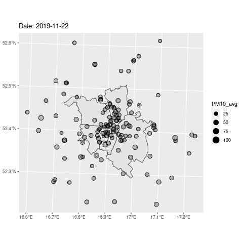
]

```{r, purl=FALSE, echo=FALSE, eval=FALSE}
gp2 <- gp1 + 
  transition_time(Date) +
  labs(title = "Date: {frame_time}") + 
  ease_aes("linear") +
  shadow_wake(wake_length = 0.1, alpha = FALSE)
# gp2
anim_save(filename = "lecture/figs/gp2.gif", gp2)
```

---
# Other mapping packages

.pull-left[
https://github.com/sjewo/cartogram
```{r, echo=FALSE}
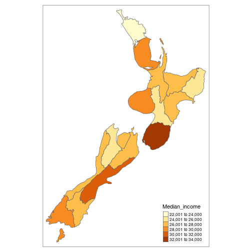
```
]
.pull-right[
https://hafen.github.io/geofacet/
```{r, echo=FALSE}
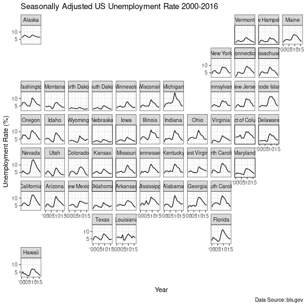
```
]


---
# Other mapping packages

.pull-left[
https://github.com/schochastics/edgebundle
```{r, echo=FALSE}
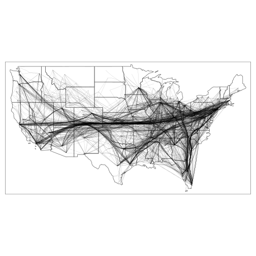
```
]
.pull-right[
https://www.rayshader.com/
```{r, echo=FALSE}
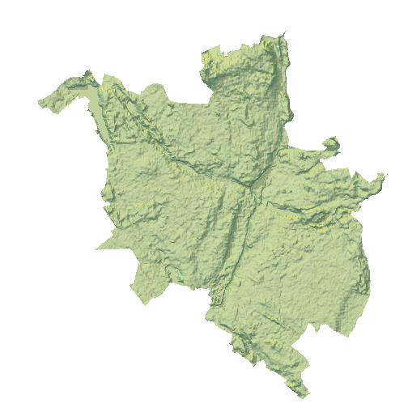
```
]

---